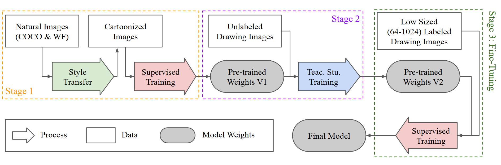
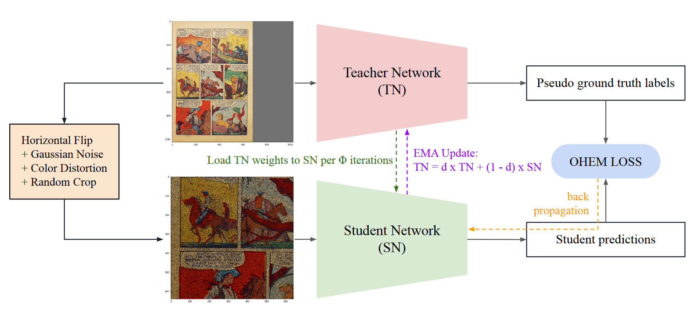
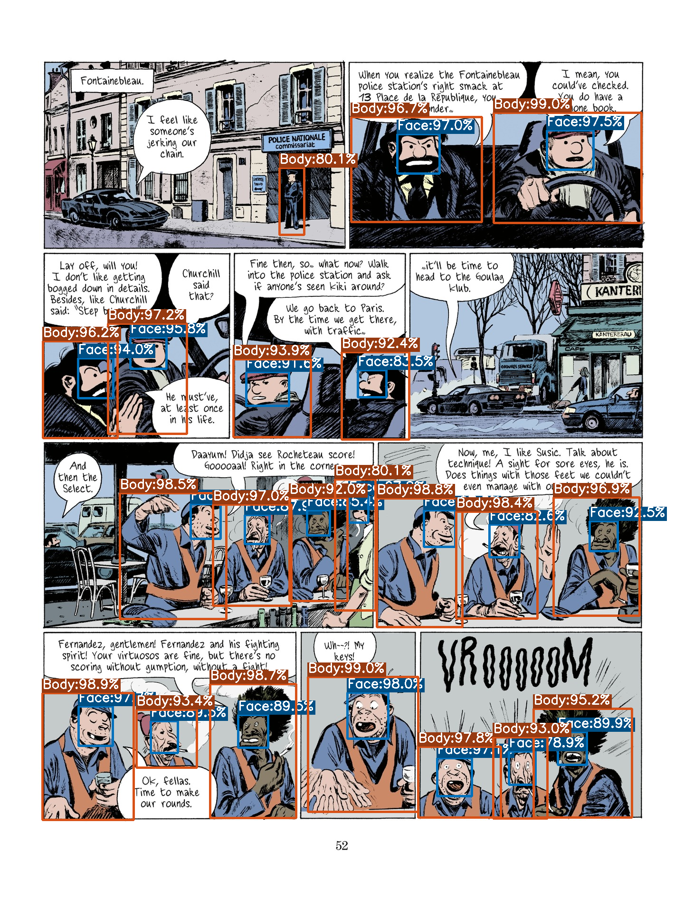
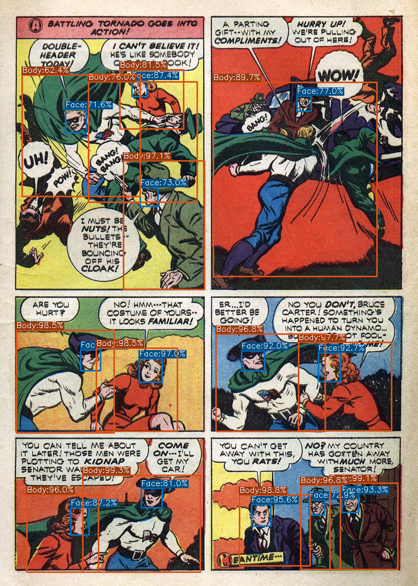
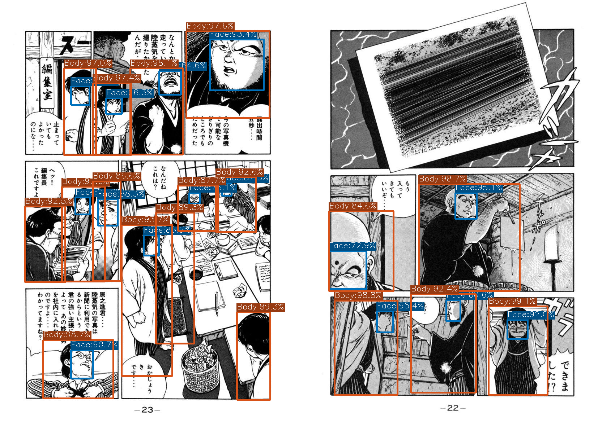

# DASS_Detector

- **Description:** Original Training Repository of the Paper: "Domain-Adaptive Self-Supervised Pre-training for Face &amp; Body Detection in Drawings"

- **Disclaimer:** The model structure and the codes are highly adopted from the [YOLOX](https://github.com/Megvii-BaseDetection/YOLOX) model.

- **Note**: If you only need inference / evaluation modules, then please visit the [inference repository](https://github.com/barisbatuhan/DASS_Det_Inference) of this study.

## Requirements

- CUDA >= 10.2
- PyTorch >= 1.8.2
- Chainer >= 7.8.1
- ChainerCV >= 0.13.1
- OpenCV-Python >= 4.5.5
- Matplotlib >= 3.3.4
- xmltodict

## Abstract

Drawings are powerful means of pictorial abstraction and communication. Understanding diverse forms of drawings including digital arts, cartoons, and comics has been a major problem of interest for the computer vision and computer graphics communities. Although there are large amounts of digitized drawings from comic books and cartoons, they contain vast stylistic variations, which necessitate expensive manual labeling for training domain-specific recognizers. In this work, we show how self-supervised learning, based on a teacher-student network with a modified student network update design, can be used to build face and body detectors. Our setup allows exploiting large amounts of unlabeled data from the target domain when labels are provided for only a small subset of it. We further demonstrate that style transfer can be incorporated into our learning pipeline to bootstrap detectors using vast amount of out-of-domain labeled images from natural images (i.e., images from the real world). Our combined architecture yields detectors with state-of-the-art (SOTA) and near-SOTA performance using minimal annotation effort.

## Pre-trained Weights

You can find all the pre-trained model weights from [here](https://drive.google.com/drive/folders/1sQX36bWeIGoAGlQUiaUA9wnEUwtVsS76?usp=sharing). Please note that: 

- if the model name includes `xs`, then the depth and width parameters should be set as `depth, width = 0.33, 0.375`. If it includes `xl`, then `depth, width = 1.33, 1.25`. 
- for the stage-2 weights (i.e., self-supervised, teacher-student), load the model with the `teacher_model` key in the weight dictionary. Otherwise use `model` key.

## Model Architecture

### Overall Pipeline



### Model Architecture


## Self-Supervised Design




## Results 

The results shared below are calculated by averaging 5 separate training run outcomes for the XS sized models. For XL sized, results of a single run is given. The best-performing models among these runs are given as the pre-trained weights. Please refer to the original paper for the complete set of results and ablation studies. 

### Face Results

Models                                                 | iCartoonFace | Manga109 | DCM772
---                                                    | ---          | ---      | --- 
**XS Stage-1**                                         | 42.50        | 54.74    | 69.93
**XS Stage-2**                                         | 49.19        | 69.25    | 82.45
**XS Stage-3 w/ Single Datasets**                      | 87.75        | 87.86    | 75.87
**XS Stage-3 w/ Mix of Datasets**                      | 83.15        | 86.45    | 78.40       
**XL Stage-3 w/ Single Datasets**                      | 90.01        | **87.88** | 77.40
**XL Stage-3 w/ Mix of Datasets**                      | 87.77        | 87.08    | **85.77**
[ACFD](https://arxiv.org/abs/2007.00899)               | **90.94**    | -        | - 
[Ogawa et al.](https://arxiv.org/abs/1803.08670)       | -            | 76.20    | -
[Nguyen et al.](https://www.mdpi.com/2313-433X/4/7/89) | -            | -        | 74.94

### Body Results

Models                                                 | Manga109 | DCM772 | Comic2k | Watercolor2k | Clipart1k
---                                                    | ---      | ---    | ---     | ---          | --- 
**XS Stage-1**                                         | 42.72    | 65.46  | 56.80   | 67.36        | 55.65
**XS Stage-2**                                         | 69.41    | 77.83  | 67.38   | 71.60        | 64.12 
**XS Stage-3 w/ Single Datasets**                      | 87.06    | 84.89  | 71.66   | 89.17        | 77.97
**XS Stage-3 w/ Mix of Datasets**                      | 86.54    | 83.52  | 75.60   | 82.68        | 75.96
**XL Stage-3 w/ Single Datasets**                      | **87.98** | 86.14  | 73.65  | **89.81**    | **83.59**
**XL Stage-3 w/ Mix of Datasets**                      | 87.50    | **87.24** | **76.00** | 84.75   | 79.63
[Ogawa et al.](https://arxiv.org/abs/1803.08670)       | 79.60    | -      | -       | -            | - 
[Nguyen et al.](https://www.mdpi.com/2313-433X/4/7/89) | -        | 76.76  | -       | -            | - 
[Inoue et al.](https://arxiv.org/abs/1803.11365)       | -        | -      | 70.10   | 77.30        | 76.20 


## Training Instructions

### Stage-1: Style-transferred Pre-training

#### Required Datasets:

- [WIDER FACE](http://shuoyang1213.me/WIDERFACE/)
- [COCO - Detection 2020](https://cocodataset.org/#download)

#### Required Style-Transferring Models:

- [**CartoonGAN**](https://github.com/mnicnc404/CartoonGan-tensorflow)**:** Hayao, Hosoda, Paprika, and Shinkai styles
- [**CycleGAN**](https://github.com/junyanz/pytorch-CycleGAN-and-pix2pix)**:** Cezanne, Monet, Van Gogh styles
- [**GANILLA**](https://github.com/giddyyupp/ganilla)**:** AS, KH, and Miyazaki styles
- [**White Box Cartonization**](https://github.com/SystemErrorWang/White-box-Cartoonization)**:** Default style

#### Steps for Dataset Preparation:

1. Process the complete WIDER FACE and COCO training images with these 11 styles from 4 cartoonization studies. The generated image outputs must be at the same shape with the original input images and must be named with the same name and extension. 
2. Instead of the default folder design of these 2 datasets, change that design into the formats below:

```
# For COCO:

> COCO
    > train2017
        > cartoongan_hayao
            > <images>
        > ...
            > <images>
        >cyclegan_cezanne
            > <images>
        > ...
            > <images>
        > ganilla_AS
            > <images>
        > ...
            > <images>
        > whitebox
            > <images>
        > original # this is where the original COCO images are placed
            > <images>

# For WIDER FACE:

> WIDERFACE
    > WIDER_train
        > images
            > cartoongan_hayao
                > <image_folders>
            > ...
                > <image_folders>
            >cyclegan_cezanne
                > <image_folders>
            > ...
                > <image_folders>
            > ganilla_AS
                > <image_folders>
            > ...
                > <image_folders>
            > whitebox
                > <image_folders>
            > original # this is where the original WIDERFACE images are placed
                > <image_folders>
```

3. Filter out the COCO images that do not include any person or animal in it. We shared the reading ids and image names of these filtered outputs in [here](datasets/yolox_coco_train_person_ids.txt).
4. Filter out the WIDER FACE images that have people that have face side lengths smaller than 1/60 of the minimum side length of the image. Filtered file paths can be found [here](datasets/widerface_diltered_1-60.txt).
5. From the [Base Experiment file](yolox/exp/base_exp.py), set the correct paths for `wf_train_imgs, wf_test_imgs, wf_train_labels, wf_test_labels` keys in the `self.face_data_dir` and `coco` key in the `self.body_data_dir`.

#### Steps for Training:


1. Set augmentation-specific hyper-parameters and epoch count from [Styled Experiment file](yolox/exp/styled_exp.py) or leave them as default.

2. Run the following command:

```
> python3 train_single_gpu.py -b <BATCH_SIZE> --fp16 -o -expn <EXPERIMENT_NAME> -ms <EITHER_xs_OR_xl> --head-mode <0_FOR_BOTH_1_FOR_FACE_2_FOR_BODY_ONLY> -cfg allstyled
```

3. You can check different configuration options from [Styled Experiment file](yolox/exp/styled_exp.py). 


### Stage-2: Self-supervised Teacher-student Pre-training

#### Required Datasets:

- [COMICS Pages](https://github.com/miyyer/comics)
- [iCartoonFace](https://github.com/luxiangju-PersonAI/iCartoonFace)
- [Manga 109](http://www.manga109.org/en/)
- [Comic 2k / Watercolor 2k / Clipart 1k](https://github.com/naoto0804/cross-domain-detection)

#### Steps for Dataset Preparation:

1. Download all the datasets and leave the file format as it is already.
2. From the [Base Experiment file](yolox/exp/base_exp.py), set the correct paths for `icf_train_imgs, icf_test_imgs, icf_train_labels, icf_test_labels, m109, golden_pages, comic, watercolor, clipart` keys in the `self.face_data_dir` and `self.body_data_dir`.

#### Steps for Training:

1. Set augmentation-specific and other hyper-parameters from [Unsupervised Experiment file](yolox/exp/unsupervised_exp.py) or leave them as default.

2. Run the following command:

```
> python3 train_single_gpu.py -b <BATCH_SIZE> --fp16 -o -expn <EXPERIMENT_NAME> -ms <EITHER_xs_OR_xl> --head-mode <0_FOR_BOTH_1_FOR_FACE_2_FOR_BODY_ONLY> -cfg uns_stu50_50 -c <STYLE_TRANSFERRED_WEIGHT_PTH_PATH>
```

3. You can check different configuration options from [Unsupervised Experiment file](yolox/exp/unsupervised_exp.py). 


### Stage-3: Fine-tuning with Annotated Drawing Data

#### Required Datasets:

- [DCM 772](https://gitlab.univ-lr.fr/crigau02/dcm-dataset/-/tree/master)
- [iCartoonFace](https://github.com/luxiangju-PersonAI/iCartoonFace)
- [Manga 109](http://www.manga109.org/en/)
- [Comic 2k / Watercolor 2k / Clipart 1k](https://github.com/naoto0804/cross-domain-detection)

#### Steps for Dataset Preparation:

1. Download all the datasets and leave the file format as it is already.
2. To increase the sizes of the datasets, we divided Manga 109 and DCM 772 pages to individual panels. We only selected the panels having at least one character. So, process these two datasets for separating the panel images and save the modified annotations. 

3. For DCM 772, you can find the panel creator script [here](datasets/dcm_panels_creator.py).
4. For Manga 109, we do not share any script but we share the folder structure:

```
##############################
# Folder Structure:
##############################

> manga109_frames
    > imgs
        > <SERIES_NAME>_<PAGE_NUMBER_WITH_3_DIGITS>_<FRAME_NUMBER>.jpg
        > ...
    > annots.json
    
##############################
# Structure of annots.json:
##############################

{
    "<SERIES_NAME>_<PAGE_NUMBER_WITH_3_DIGITS>_<FRAME_NUMBER>.jpg": {
        "face": [[xmin, ymin, xmax, ymax], ...],
        "body": [[xmin, ymin, xmax, ymax], ...],
    },
    ...
}

```

5. From the [Base Experiment file](yolox/exp/base_exp.py), set the correct paths for `icf_train_imgs, icf_test_imgs, icf_train_labels, icf_test_labels, m109_frames_imgs, m109_frames_labels, dcm772_frames_imgs, dcm772_frames_labels, dcm772_frames_partition, comic, watercolor, clipart` keys in the `self.face_data_dir` and `self.body_data_dir`.

#### Steps for Mixed Data Training:

1. Set augmentation-specific and other hyper-parameters from [Comic Experiment file](yolox/exp/comic_exp.py) or leave them as default.

2. Run the following command:

```
> python3 train_single_gpu.py -b <BATCH_SIZE> --fp16 -o -expn <EXPERIMENT_NAME> -ms <EITHER_xs_OR_xl> --head-mode <0_FOR_BOTH_1_FOR_FACE_2_FOR_BODY_ONLY> -cfg comic -c <SELF_SUPERVISED_WEIGHT_PTH_PATH>
```

#### Steps for Single Dataset Training:

1. Set augmentation-specific and other hyper-parameters from [Single Dataset Experiment file](yolox/exp/single_dataset_exp.py) or leave them as default.

2. Run the following command:

```
> python3 train_single_gpu.py -b <BATCH_SIZE> --fp16 -o -expn <EXPERIMENT_NAME> -ms <EITHER_xs_OR_xl> --head-mode <0_FOR_BOTH_1_FOR_FACE_2_FOR_BODY_ONLY> -cfg <icartoonface / manga109 / dcm772 / comic2k> -c <SELF_SUPERVISED_WEIGHT_PTH_PATH>
```

## Evaluation Instructions

### Required Datasets:

In addition to the datasets in the **Stage-3: Fine-tuning with Annotated Drawing Data** subsection, you can download [eBDtheque](https://ebdtheque.univ-lr.fr/) and set the correct file path in [Base Experiment file](yolox/exp/base_exp.py).

### Steps for Evaluation:

If you retrieved the final weights from your training, please use the [inference repository](https://github.com/barisbatuhan/DASS_Det_Inference) to evaluate your models.

## Visual Examples from "XS Stage-3 Fine-Tuned w/ Mix of Datasets"






